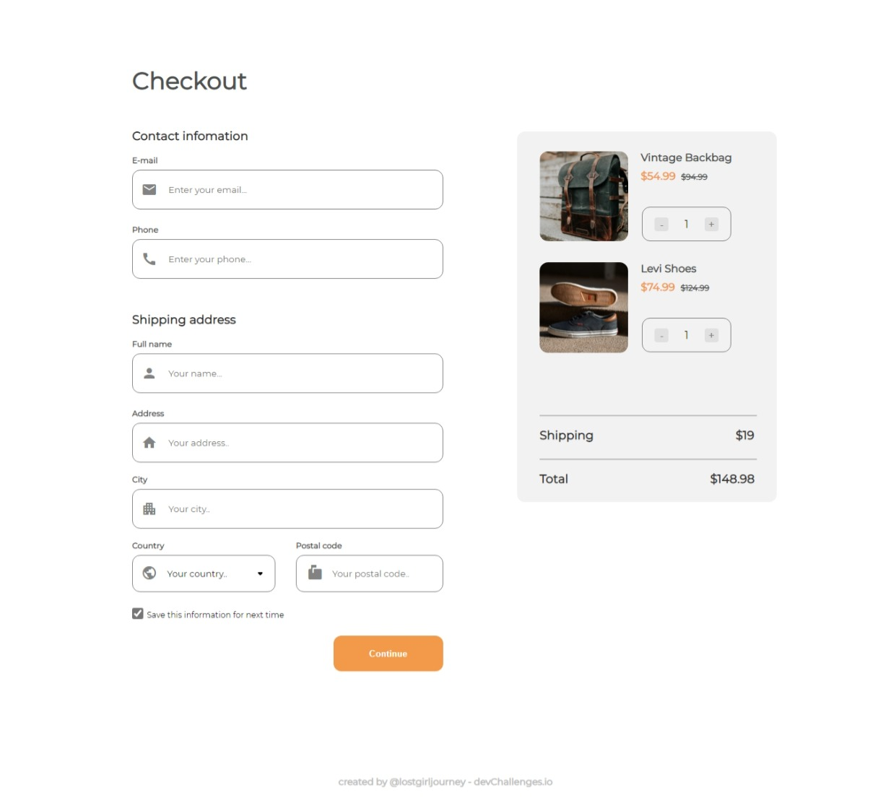
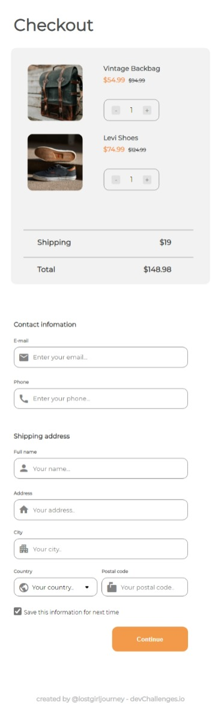

<h1 align="center">Checkout Page</h1>

   Solution for a challenge from  <a href="http://devchallenges.io" target="_blank">Devchallenges.io</a>.

  <h3>
    <a href="https://checkout-page-solution.netlify.app/">
      Demo
    </a>
     | 
    <a href="https://github.com/lostgirljourney/Checkout-Page-Challenge">
      Solution
    </a>
     | 
    <a href="https://devchallenges.io/challenges/0J1NxxGhOUYVqihwegfO">
      Challenge
    </a>
  </h3>

## Table of Contents

- [Overview](#overview)
  - [Built With](#built-with)
- [Features](#features)
- [Contact](#contact)

## Overview

  <b>Laptop View</b>
   
  
    
  <b>Mobile View</b>
   
  

Challenge was to create a ***404 not found page*** following the design given in website. The page should be responsive.

### Built With

- HTML
- CSS
- JavaScript
- Netlify

## Features

This application/site was created as a submission to a [DevChallenges](https://devchallenges.io/challenges) challenge. The [challenge](https://devchallenges.io/challenges/0J1NxxGhOUYVqihwegfO) was to build an application to complete the given user stories.

## Contact

- GitHub: [@lostgirljourney](https://github.com/lostgirljourney)
- Twitter: [@melophilecoder](https://twitter.com/melophilecoder)
